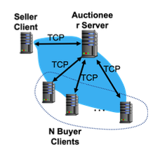
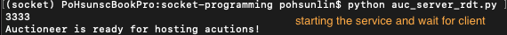
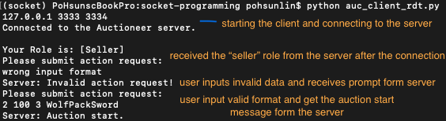
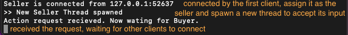
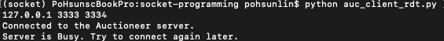

# Socket Programming
This is a project assignment for Internet Protocols course (CSC 573) at NCSU. In this assignment, we are required to build an auction system including an auction server, an auction seller, and multiple auction buyers. TCP connections are used in every text communications in the whole auctioneer process, and UDP connection with reliable data transfer mechanism is used in file transfer.
## Background
Auction theory has been proven very useful in many types of economic markets. The basic scenario of an auction is to sell a piece of good or service to one of a group of potential Buyers with the maximum price. There are two types of auctions, open-bid auction and sealed-bid auction, which are commonly used in different scenarios:
- **Open-bid auction**: The bids are open to all participants. The auction commonly goes in a sequential manner, with either Buyers or the auctioneer continuously announcing new prices until a highest acceptable price is identified. In an English auction (aka open-bid ascending price auction), a lowest price is announced by the auctioneer, after which participants compete with each other by raising the price until a highest bid receives no further competition and wins the auction. In a Dutch auction (aka open-bid descending price auction), the auctioneer announces a high asking price, and continuously lower the price until a first accepting bid is received, which wins the auction. Note that in an open-bid auction, the final winning price is known to all participants.
- **Sealed-bid auction**: Instead of having multiple bidding rounds, a sealed-bid auction happens in only one round. Each participant secretly submits a bid in a sealed envelope to the auctioneer, who then finds the highest bid and the winner. In a sealed-bid first-price auction, participant with the highest bid wins, and pays exactly the price that he/she bids (the highest bid). In a sealed-bid second-price auction (aka Vickrey auction), participant with highest bid also wins, but only pays the price of the second highest bid. Note that in a sealed-bid auction, the bids of each participant (including the winning bid) can be kept secret from all other participants, thus respecting participants’ privacy.

The sealed-bid auction is very useful when people have secret values about the good and do not want to reveal their secret values to other participants. A typical application scenario is actually in the reverse auction scenario, where a government / company is choosing among multiple subcontracting companies to complete a specific task with the lowest price, a process called tendering for procurement. When the auction finisihed, we assume that the item being sold by each sender is a digital copy of a large private file (such as an authorized, expensive copy of high-resolution image/video file). For some reason the file can only be sold to one user, and hence only the top-bid buyer should receive this file. The requirement is that whoever wins the bid should be able to receive this file reliably. And in the mean time for some reason the seller decides not to use TCP (perhaps in fear of potential TCP SYN attacks that is too costly to defend against for a small file server).
## Project Scenario
In this project, we will implement socket-based programs that will simulate the sealed-bid auctions. There will be 2 types of processes running to create this simulation: an “Auctioneer” server for hosting the auctions, and a “Seller/Buyer” client both for submitting auction requests to the auctioneer, and for bidding for items in the auction. A client can by either a Seller, or a Buyer, but not both.

An auction starts with a Seller submitting an auction request to the Auctioneer, which specifies the type of auction (first-price or second-price), the lowest price acceptable to the Seller, the intended number of bids, and the good to be sold. The Auctioneer opens up the auction after receiving the request (if no other auction is on-going), and starts accepting bids from Buyers. A Buyer submits a bid to the Auctioneer by first connecting to the Auctioneer server, and then submitting its bid. Once a bid is received from every connected, the Auctioneer processes all bids, finds the highest bid, and notifies the Seller and the Buyers status of the auction. After the auction, sender and winner (buyer) will additionally jointly carry out the transfer of the file from the seller, directly to the winning buyer, with the help from the auction server (who now acts as the index server in a peer-to-peer transfer scenario).

## Dry Run Example
### Auctioneer Server
The server is continuously listening on a welcoming TCP port for clients to connect to it. When the server detects that a new client is trying to connect to it, it creates a new TCP socket to talk to that specific client and does the following:

1. The server runs in two states: “Waiting for Seller” (status 0), and “Waiting for Buyer” (status 1). The server starts in status 0.
2. If the server is running in status 0, and there has not been any client connected to it, the next connected client assumes the Seller role. The server will inform the client to submit an auction request, and wait for it to submit its auction request. For any other in-coming connection before the server receives the auction request, the server replies “Server busy!” to the new client and closes the connection.

    a. To realize this, you can create a new thread to handle the input from the Seller client, while the original thread is still accepting new in-coming clients, sending out a busy message after each connected, and closing the connection.
    
    b. Display a message when the new thread is spawned.

3. Upon receiving a message from the Seller, the server decodes the message into four fields: <type_of_auction> (1 for first-price, and 2 for second-price), <lowest_price> (positive integer), <number_of_bids> (positive integer < 10), and <item_name> (char array of size <= 255).
    
    a. If the decoding fails, the server informs the Seller “Invalid auction request!”, and waits for the Seller to send another request.

    b. If the decoding succeeds, the server informs the Seller “Auction request received: [message_received]”. The server then changes to status 1.

4. In status 1, the server will accept in-coming connections from up to <number_of_bids> clients as Buyers. When a client is connected:

    a. If the current number of Buyers is smaller than <number_of_bids>, the server informs the client that the server is currently waiting for other Buyers, and waits for other connections.

    b. If the current number of Buyers is equal to <number_of_bids>, the server tells every connected client “Bidding start!”, and starts the bidding process.

    c. If the current number of Buyers exceeds <number_of_bids>, the server tells the new client “Bidding on-going!”, and closes the connection.

5. The server starts the bidding process by creating a new thread for handling the bidding inputs from Buyers, while the original thread is dedicated to rejecting newly coming clients as in Step 4 during this process. Display a message when the new thread is spawned.

6. During bidding, the server will continuously receive data from any Buyer who has not submitted a bid yet. Upon receiving a message from a Buyer:

    a. If the message contains a single positive integer as the bid, the server records the bid with the sending Buyer, tells the Buyer “Bid received. Please wait...”, and does not accept any further message from this Buyer.

    b. If the message contains any other data, the server informs the Buyer “Invalid bid. Please submit a positive integer!”, and attempts to receive another round of message from this Buyer.

7. Upon receiving all bids, the server will run through all Buyers and their bids, and identify the Buyer with the highest bid b. It then decides the result of this auction as follows:

    a. If the highest bid is no less than <lowest_price>, the auction succeeds. The server does the following:
        
    1. If the <type_of_auction> = 1 (first-price), the server tells the Seller that the item is sold for b dollars, then tells the highest-bid Buyer that it won in this auction and now has a payment due of b dollars, and finally tells each of the other Buyers that unfortunately it did not win in this auction. The server then closes the connection to all clients. (We omit the actual payment and good delivery in this project, and defer that to our next project.)

    2. If the <type_of_auction> = 2 (second-price), the server finds the second highest bid b1 among all bids including the Seller’s <lowest_price>. The server then tells the Seller that the item is sold for b1 dollars, then tells the highest-bid Buyer that it won in this auction and now has a payment due of b1 dollars, and finally tells each of the other Buyers that unfortunately it did not win in this auction. The server then closes the connection to all clients.

    3. In either case, the server will additionally send the following information to the seller and the winning buyer:
    
        - To Seller: the Winning Buyer’s IP address in the format of x.x.x.x

        - To Winning Buyer: the Seller’s IP address in the format of y.y.y.y

    b. If the highest bid is less than <lowest_price>, the server tells the Seller that unfortunately its item was not sold in the auction, and tells all other clients that unfortunately they did not win in the auction. The server then closes all connections.

8. After the auction is done and everyone is informed, the server cleans all the information about this auction including the list of Buyers, and then reset its status to 0, to wait for any other Seller’s connection and auction request.
### Seller/Buyer Client
When the client starts, it tries to contact the server on a specified port.
For UDP-based message exchange and file transfer, the Seller and the Winning Buyer will implement a unidirectional, Stop-and-Wait reliable data transfer protocol. To implement Stop-and-Wait reliable data transfer, each message below is associated with a meta-header containing the following information, all assumed to be 8-bit long unsigned integers: SEQ/ACK (sequence/ACK number), TYPE (message_type). The TYPE takes two values 0 and 1, where 0 means the message does not contain content of actual file to be transferred, and 1 means the message contains actual content. These fields precede any actual data in a message. The first message that a party sends via a socket always has sequence number 0. In the following, we omit the meta-header in describing the messages exchanged. We assume the Seller is always the sender (client), while the Winning Buyer is the receiver (server).
#### Seller Mode
1. If the client receives message from the server to submit an auction request after connection, it holds the role of a Seller.
2. To proceed, the client sends an auction request, in the form of “<type_of_auction> <lowest_price> <number_of_bids> <item_name>”, to the server, and waits for server reply.
3. If the server indicates an invalid request, the client must resend a valid request.
4. If the server indicates “Auction request received: [message_sent]”, the client waits until
the auction finishes to obtain the auction result.

UDP-based reliable message exchange and data transfer
All messages below happen in a separate UDP socket, different from the TCP socket as before. All messages must be authenticated: they must be from the authentic IP address that the server informs, otherwise they must be discarded.

5. If the auction result is success, the Seller client will open up a UDP socket, and start sending messages to the Winning Buyer with RDT. The Seller first needs to read the content of a file “tosend.file” as a binary byte string, from its local drive. It then divides the byte string into chunks each with a size of 2000 bytes, representing the maximum segment size.
6. The Seller first sends a transmission start message “start X”, where X denotes the total size of the file to be transmitted. This message has type 0 (a control message).

    a. In all message exchange, if any message/ACK is received from an IP address not matching the Winning Buyer’s IP, the message/ACK should be directly discarded.

7. After receiving the correct acknowledgement, the Seller starts transmitting the file content.

    a. Seller sends each chunk after receiving the acknowledgement from the Winning Buyer of the previous message exchanged, and put the new chunk into the retransmission buffer.

    b. A timer is set when each message is transmitted / retransmitted, with a timeout value of 2 seconds.

    c. If the timer times out on a message, the sender retransmits the current message in buffer.
8. After all data is sent and acknowledged, Seller informs the Winning Buyer end-of-transmission with a control message “fin”, and then exits.
#### Buyer Mode
1. If the client receives message from the server to wait for other Buyer or start bidding, it holds the role of a Buyer.
2. When the bidding starts, the Buyer sends its bid (a positive integer value) to the server.
3. If the server indicates an invalid bid, the client must resend a valid bid.
4. If the server indicates “Bid received”, the client waits for the final result of the auction.

UDP-based reliable message exchange and data transfer
All messages below happen in a separate UDP socket, different from the TCP socket as before. All messages must be authenticated: they must be from the authentic IP address that the server informs, otherwise they must be discarded.

5. If the auction result is success to the current client (the client is the Winning Buyer -- WB), the client will open up a UDP socket, and then listen on a pre-defined port.
6. WB then waits for messages from the sender.

    a. If an incoming message has unmatched source IP, it should be discarded.

    b. If an incoming message is a data message (with TYPE=1), store the data into a local buffer.

    c. If an incoming message is a control message “start X”, interpret the value of X as the total file size expected to be received.

    d. If an incoming message is a control message “fin”, end the transmission and
save all received file content in the local buffer, in-order, to a local file named “recved.file”, and then exit.

    e. Out-of-order / duplicate messages should be properly detected and handled
based on RDT, such that they will not stall the transmission process or cause error to the file content.

After the Seller and WB processes end, you should check correctness of your RDT protocol, by manually comparing the files “tosend.file” and “recved.file”. This can be done using the “diff tosend.file recved.file” command on Linux/Mac machines, or the “fc /B tosend.file recved.file” command on Windows machines.

### Packet loss Model
Here, in addition to implementing a faithful RDT protocol, we also want to simulate a network with packet loss (otherwise RDT would not be useful). Without messing up with the underlying layers, we simulate a lossy network by explicitly implement packet loss in the application layer.

Specifically:
- Whenever a UDP message is received at a client (either Seller or WB), before doing
anything with the message, client rolls a dice, and directly discard the message with probability <packet_loss_rate>.

- This can be done using a number ways, the easiest being using some existing package such as “numpy”. Specifically, for each message, you can call “numpy.random. binomial(n=1, p=packet_loss_rate)” to generate a flag, which equals to 1 with probability packet_loss_rate, and 0 with probability (1-packet_loss_rate).

The <packet_loss_rate> is given when a client program is started, indicating how lossy the simulated network is. It’s value ranges between [0.0, 1.0].

## Program Output
The figure below represents a visual of the communication between the Seller/Buyer clients and the Auctioneer Server.

  

### Starting the Auctioneer server
The server is started by specifying the TCP port of the welcoming socket. In the screenshot below, the server is running on port 3333.

  

### Starting the client (Seller)
When starting the client, we have to specify the IP address of the Auction Server and the port number where the server is running. In the example below, the server is at IP address 127.0.0.1 running on TCP port 3333. If successfully connected, a message is displayed with relevant information. When a request is entered from the Seller side, if it is invalid, the server should return an invalid prompt; if it is valid, the server should send a feedback to the Sellerand set itself to wait for Buyers. The Seller then displays a message indicating the auction has started. Here the request “2 10 3 WolfPackSword” is used as an example (which means “use auction type 2, starting at $10 minimum, allow 2 bids, for the item name ‘WolfPackSword’ to be sold.”)

  

On the server side:

  

  

If another client is trying to connect to the server after the Seller is connected but before the request is received, the server will give a busy prompt, and then close the connection:

  

### Starting the Client (Buyer)